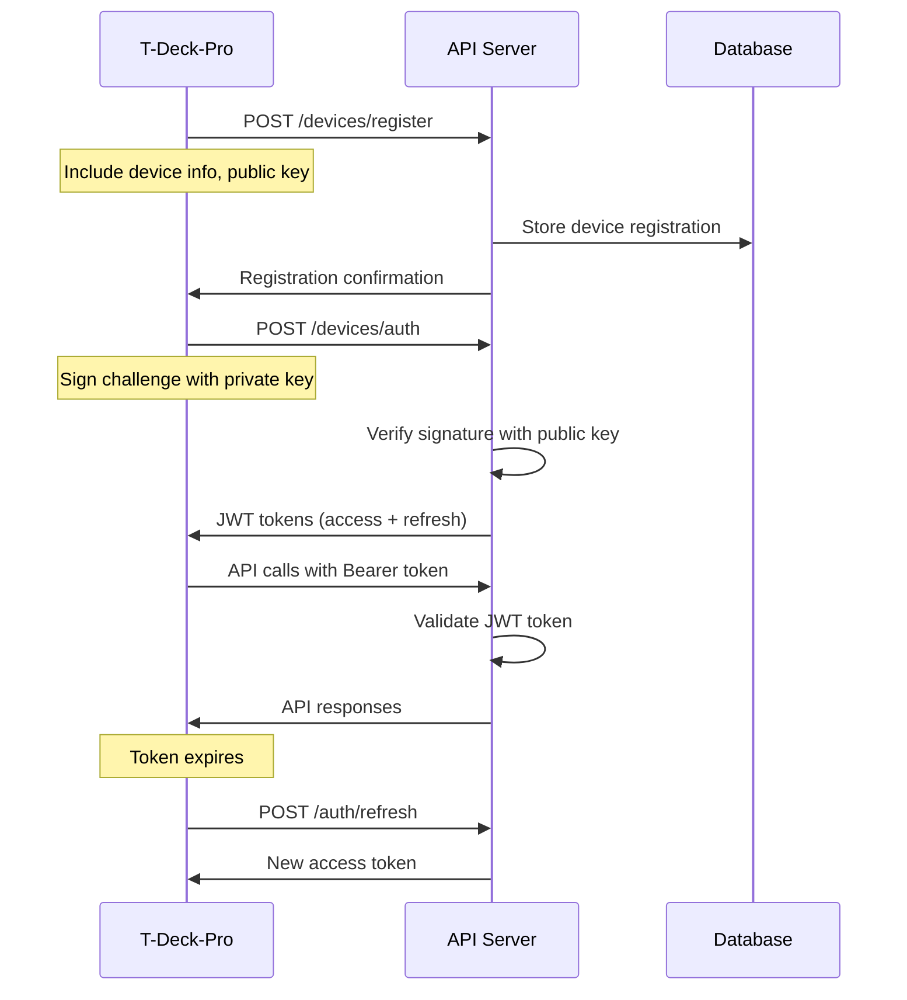

# T-Deck-Pro OS Integration Guide

## Table of Contents

1. [Overview](#overview)
2. [T-Deck-Pro OS Integration Points](#t-deck-pro-os-integration-points)
3. [Server Client Implementation](#server-client-implementation)
4. [Communication Protocols](#communication-protocols)
5. [Authentication Flow](#authentication-flow)
6. [Application Management Integration](#application-management-integration)
7. [OTA Update Integration](#ota-update-integration)
8. [Telemetry Integration](#telemetry-integration)
9. [Meshtastic Bridge Integration](#meshtastic-bridge-integration)
10. [Error Handling and Resilience](#error-handling-and-resilience)
11. [Testing Integration](#testing-integration)
12. [Performance Optimization](#performance-optimization)

## Overview

This guide provides comprehensive instructions for integrating the T-Deck-Pro Operating System with the server infrastructure. The integration enables cloud-based device management, OTA updates, application distribution, telemetry collection, and mesh network bridging.

### Integration Architecture

```
T-Deck-Pro Device                    Server Infrastructure
┌─────────────────────┐             ┌─────────────────────┐
│                     │             │                     │
│  ┌───────────────┐  │   Tailscale │  ┌───────────────┐  │
│  │ Application   │  │     VPN     │  │  API Gateway  │  │
│  │ Framework     │◄─┼─────────────┼─►│               │  │
│  └───────────────┘  │             │  └───────────────┘  │
│           │          │             │           │         │
│  ┌───────────────┐  │             │  ┌───────────────┐  │
│  │ Server Client │  │             │  │ Microservices │  │
│  │ Manager       │  │             │  │   - API       │  │
│  └───────────────┘  │             │  │   - OTA       │  │
│           │          │             │  │   - Telemetry │  │
│  ┌───────────────┐  │             │  │   - Mesh      │  │
│  │Communication │  │             │  └───────────────┘  │
│  │ Stack         │  │             │           │         │
│  └───────────────┘  │             │  ┌───────────────┐  │
│                     │             │  │   Database    │  │
└─────────────────────┘             │  │   & Cache     │  │
                                    │  └───────────────┘  │
                                    └─────────────────────┘
```

## T-Deck-Pro OS Integration Points

### 1. Server Client Manager

Create a new component in the T-Deck-Pro OS to handle all server communication:

**File**: `src/core/communication/server_client_manager.h`

```cpp
#pragma once

#include <WiFiClientSecure.h>
#include <HTTPClient.h>
#include <WebSocketsClient.h>
#include <ArduinoJson.h>
#include "core/utils/logger.h"
#include "core/apps/app_manager.h"

class ServerClientManager {
private:
    // HTTP Client for REST API calls
    HTTPClient httpClient;
    WiFiClientSecure secureClient;
    
    // WebSocket for real-time communication
    WebSocketsClient webSocket;
    
    // Configuration
    String serverBaseUrl;
    String deviceId;
    String authToken;
    String refreshToken;
    
    // State management
    bool isConnected;
    bool isAuthenticated;
    unsigned long lastHeartbeat;
    unsigned long lastTelemetrySync;
    
    // Internal methods
    bool performAuthentication();
    bool refreshAuthToken();
    void handleWebSocketEvent(WStype_t type, uint8_t* payload, size_t length);
    void sendHeartbeat();
    void syncTelemetry();
    
public:
    ServerClientManager();
    ~ServerClientManager();
    
    // Initialization and connection
    bool initialize(const String& serverUrl, const String& deviceId);
    bool connect();
    void disconnect();
    bool isServerConnected() const;
    
    // Authentication
    bool authenticate();
    bool registerDevice(const JsonObject& deviceInfo);
    
    // Device management
    bool updateDeviceStatus(const JsonObject& status);
    bool getDeviceConfig(JsonObject& config);
    bool updateDeviceConfig(const JsonObject& config);
    
    // Application management
    bool getAvailableApps(JsonArray& apps);
    bool downloadApp(const String& appId, const String& version, const String& savePath);
    bool reportAppStatus(const String& appId, const String& status);
    
    // OTA updates
    bool checkForUpdates(JsonObject& updateInfo);
    bool downloadUpdate(const String& updateId, const String& savePath);
    bool reportUpdateStatus(const String& updateId, const String& status);
    
    // Telemetry
    bool sendTelemetry(const JsonObject& telemetry);
    bool sendBatchTelemetry(const JsonArray& telemetryBatch);
    
    // Mesh integration
    bool sendMeshMessage(const JsonObject& message);
    bool getMeshMessages(JsonArray& messages);
    
    // Real-time communication
    void enableRealTimeUpdates();
    void disableRealTimeUpdates();
    
    // Maintenance
    void update(); // Call from main loop
    void handleOfflineMode();
    void syncWhenOnline();
};
```

### 2. Integration with Application Framework

Modify the existing AppManager to integrate with server communication:

**File**: `src/core/apps/app_manager.cpp` (additions)

```cpp
#include "core/communication/server_client_manager.h"

class AppManager {
private:
    ServerClientManager* serverClient;
    
    // Add server integration methods
    void syncAppsWithServer();
    void handleServerAppInstall(const String& appId, const String& version);
    void reportAppStatusToServer(const String& appId, const String& status);
    
public:
    // Add server client integration
    void setServerClient(ServerClientManager* client) {
        serverClient = client;
    }
    
    // Enhanced app management with server sync
    bool installAppFromServer(const String& appId, const String& version) {
        if (!serverClient || !serverClient->isServerConnected()) {
            Logger::warning("Server not available for app installation");
            return false;
        }
        
        // Download app from server
        String appPath = "/apps/" + appId + "_" + version + ".bin";
        if (!serverClient->downloadApp(appId, version, appPath)) {
            Logger::error("Failed to download app from server");
            return false;
        }
        
        // Install app locally
        if (installAppFromFile(appId, appPath)) {
            // Report successful installation to server
            JsonDocument statusDoc;
            statusDoc["status"] = "installed";
            statusDoc["version"] = version;
            statusDoc["timestamp"] = getCurrentTimestamp();
            
            serverClient->reportAppStatus(appId, statusDoc.as<JsonObject>());
            return true;
        }
        
        return false;
    }
    
    // Sync app status with server
    void syncWithServer() {
        if (!serverClient || !serverClient->isServerConnected()) {
            return;
        }
        
        // Get available apps from server
        JsonDocument appsDoc;
        JsonArray availableApps = appsDoc.to<JsonArray>();
        
        if (serverClient->getAvailableApps(availableApps)) {
            // Process available apps and check for updates
            for (JsonObject app : availableApps) {
                String appId = app["id"];
                String serverVersion = app["version"];
                
                if (isAppInstalled(appId)) {
                    String localVersion = getAppVersion(appId);
                    if (compareVersions(serverVersion, localVersion) > 0) {
                        Logger::info("Update available for " + appId + ": " + localVersion + " -> " + serverVersion);
                        // Optionally auto-update or notify user
                    }
                } else {
                    // Check if app should be auto-installed
                    if (app["auto_install"].as<bool>()) {
                        Logger::info("Auto-installing app: " + appId);
                        installAppFromServer(appId, serverVersion);
                    }
                }
            }
        }
    }
};
```

### 3. Communication Stack Integration

Enhance the existing communication managers to support server connectivity:

**File**: `src/core/communication/communication_manager.cpp` (additions)

```cpp
#include "server_client_manager.h"

class CommunicationManager {
private:
    ServerClientManager serverClient;
    
public:
    bool initializeServerConnection() {
        String serverUrl = getConfigValue("server_url", "https://api.tdeckpro.local");
        String deviceId = getConfigValue("device_id", generateDeviceId());
        
        if (!serverClient.initialize(serverUrl, deviceId)) {
            Logger::error("Failed to initialize server client");
            return false;
        }
        
        // Attempt to connect and authenticate
        if (serverClient.connect() && serverClient.authenticate()) {
            Logger::info("Successfully connected to server");
            return true;
        }
        
        Logger::warning("Server connection failed, operating in offline mode");
        return false;
    }
    
    void updateServerConnection() {
        serverClient.update();
        
        // Handle connection state changes
        static bool wasConnected = false;
        bool isConnected = serverClient.isServerConnected();
        
        if (isConnected && !wasConnected) {
            Logger::info("Server connection established");
            onServerConnected();
        } else if (!isConnected && wasConnected) {
            Logger::warning("Server connection lost");
            onServerDisconnected();
        }
        
        wasConnected = isConnected;
    }
    
private:
    void onServerConnected() {
        // Sync cached data when connection is restored
        serverClient.syncWhenOnline();
        
        // Notify app manager to sync apps
        if (appManager) {
            appManager->syncWithServer();
        }
        
        // Send any cached telemetry
        sendCachedTelemetry();
    }
    
    void onServerDisconnected() {
        // Switch to offline mode
        serverClient.handleOfflineMode();
    }
};
```

## Server Client Implementation

### Complete ServerClientManager Implementation

**File**: `src/core/communication/server_client_manager.cpp`

```cpp
#include "server_client_manager.h"
#include "core/hal/board_config.h"
#include "core/utils/crypto_utils.h"

ServerClientManager::ServerClientManager() 
    : isConnected(false), isAuthenticated(false), lastHeartbeat(0), lastTelemetrySync(0) {
    
    // Configure secure client
    secureClient.setInsecure(); // For development - use proper certificates in production
    
    // Configure WebSocket event handler
    webSocket.onEvent([this](WStype_t type, uint8_t* payload, size_t length) {
        handleWebSocketEvent(type, payload, length);
    });
}

bool ServerClientManager::initialize(const String& serverUrl, const String& deviceId) {
    this->serverBaseUrl = serverUrl;
    this->deviceId = deviceId;
    
    Logger::info("Initializing server client for device: " + deviceId);
    Logger::info("Server URL: " + serverUrl);
    
    return true;
}

bool ServerClientManager::connect() {
    if (isConnected) {
        return true;
    }
    
    // Test basic connectivity
    httpClient.begin(secureClient, serverBaseUrl + "/api/v1/system/status");
    httpClient.setTimeout(10000);
    
    int httpCode = httpClient.GET();
    httpClient.end();
    
    if (httpCode == 200) {
        isConnected = true;
        Logger::info("Server connectivity verified");
        
        // Attempt authentication
        if (authenticate()) {
            // Start WebSocket connection for real-time updates
            String wsUrl = serverBaseUrl;
            wsUrl.replace("https://", "wss://");
            wsUrl.replace("http://", "ws://");
            wsUrl += "/ws";
            
            webSocket.begin(wsUrl, 443, "/");
            webSocket.setReconnectInterval(5000);
            
            return true;
        }
    } else {
        Logger::error("Server connectivity test failed: " + String(httpCode));
    }
    
    return false;
}

bool ServerClientManager::authenticate() {
    if (isAuthenticated && !authToken.isEmpty()) {
        return true;
    }
    
    // Check if we have a stored refresh token
    if (!refreshToken.isEmpty()) {
        if (refreshAuthToken()) {
            return true;
        }
    }
    
    // Perform device authentication using public key cryptography
    return performAuthentication();
}

bool ServerClientManager::performAuthentication() {
    httpClient.begin(secureClient, serverBaseUrl + "/api/v1/devices/auth");
    httpClient.addHeader("Content-Type", "application/json");
    
    // Create authentication request
    JsonDocument authDoc;
    authDoc["device_id"] = deviceId;
    
    // Generate challenge response using device private key
    String challenge = CryptoUtils::generateChallenge();
    String challengeResponse = CryptoUtils::signChallenge(challenge, getDevicePrivateKey());
    authDoc["challenge_response"] = challengeResponse;
    
    String authPayload;
    serializeJson(authDoc, authPayload);
    
    int httpCode = httpClient.POST(authPayload);
    
    if (httpCode == 200) {
        String response = httpClient.getString();
        JsonDocument responseDoc;
        
        if (deserializeJson(responseDoc, response) == DeserializationError::Ok) {
            if (responseDoc["success"]) {
                authToken = responseDoc["data"]["access_token"].as<String>();
                refreshToken = responseDoc["data"]["refresh_token"].as<String>();
                
                // Store tokens securely
                storeAuthTokens(authToken, refreshToken);
                
                isAuthenticated = true;
                Logger::info("Device authentication successful");
                
                httpClient.end();
                return true;
            }
        }
    }
    
    Logger::error("Device authentication failed: " + String(httpCode));
    httpClient.end();
    return false;
}

bool ServerClientManager::sendTelemetry(const JsonObject& telemetry) {
    if (!isConnected || !isAuthenticated) {
        // Cache telemetry for later transmission
        cacheTelemetry(telemetry);
        return false;
    }
    
    httpClient.begin(secureClient, serverBaseUrl + "/api/v1/telemetry");
    httpClient.addHeader("Content-Type", "application/json");
    httpClient.addHeader("Authorization", "Bearer " + authToken);
    
    String payload;
    serializeJson(telemetry, payload);
    
    int httpCode = httpClient.POST(payload);
    httpClient.end();
    
    if (httpCode == 200 || httpCode == 201) {
        Logger::debug("Telemetry sent successfully");
        lastTelemetrySync = millis();
        return true;
    } else if (httpCode == 401) {
        // Token expired, try to refresh
        if (refreshAuthToken()) {
            return sendTelemetry(telemetry); // Retry once
        }
        isAuthenticated = false;
    }
    
    Logger::error("Failed to send telemetry: " + String(httpCode));
    cacheTelemetry(telemetry);
    return false;
}

bool ServerClientManager::checkForUpdates(JsonObject& updateInfo) {
    if (!isConnected || !isAuthenticated) {
        return false;
    }
    
    String url = serverBaseUrl + "/api/v1/ota/check-updates";
    url += "?device_id=" + deviceId;
    url += "&current_firmware=" + getCurrentFirmwareVersion();
    
    httpClient.begin(secureClient, url);
    httpClient.addHeader("Authorization", "Bearer " + authToken);
    
    int httpCode = httpClient.GET();
    
    if (httpCode == 200) {
        String response = httpClient.getString();
        JsonDocument responseDoc;
        
        if (deserializeJson(responseDoc, response) == DeserializationError::Ok) {
            if (responseDoc["success"]) {
                updateInfo.set(responseDoc["data"]);
                httpClient.end();
                return true;
            }
        }
    }
    
    httpClient.end();
    return false;
}

bool ServerClientManager::downloadUpdate(const String& updateId, const String& savePath) {
    if (!isConnected || !isAuthenticated) {
        return false;
    }
    
    String url = serverBaseUrl + "/api/v1/ota/download/firmware/" + updateId;
    
    httpClient.begin(secureClient, url);
    httpClient.addHeader("Authorization", "Bearer " + authToken);
    
    int httpCode = httpClient.GET();
    
    if (httpCode == 200) {
        // Stream download to file
        File updateFile = SPIFFS.open(savePath, "w");
        if (!updateFile) {
            Logger::error("Failed to create update file: " + savePath);
            httpClient.end();
            return false;
        }
        
        WiFiClient* stream = httpClient.getStreamPtr();
        size_t totalSize = httpClient.getSize();
        size_t downloaded = 0;
        
        uint8_t buffer[1024];
        while (httpClient.connected() && downloaded < totalSize) {
            size_t available = stream->available();
            if (available > 0) {
                size_t readBytes = stream->readBytes(buffer, min(available, sizeof(buffer)));
                updateFile.write(buffer, readBytes);
                downloaded += readBytes;
                
                // Report progress
                int progress = (downloaded * 100) / totalSize;
                Logger::debug("Download progress: " + String(progress) + "%");
            }
            delay(1);
        }
        
        updateFile.close();
        httpClient.end();
        
        if (downloaded == totalSize) {
            Logger::info("Update downloaded successfully: " + savePath);
            return true;
        } else {
            Logger::error("Download incomplete: " + String(downloaded) + "/" + String(totalSize));
            SPIFFS.remove(savePath);
        }
    }
    
    httpClient.end();
    return false;
}

void ServerClientManager::update() {
    unsigned long currentTime = millis();
    
    // Send heartbeat every 30 seconds
    if (isConnected && isAuthenticated && (currentTime - lastHeartbeat > 30000)) {
        sendHeartbeat();
        lastHeartbeat = currentTime;
    }
    
    // Sync telemetry every 5 minutes
    if (isConnected && isAuthenticated && (currentTime - lastTelemetrySync > 300000)) {
        syncTelemetry();
    }
    
    // Handle WebSocket events
    webSocket.loop();
    
    // Check connection status
    if (isConnected && !testConnectivity()) {
        Logger::warning("Server connection lost");
        isConnected = false;
        isAuthenticated = false;
    }
}

void ServerClientManager::handleWebSocketEvent(WStype_t type, uint8_t* payload, size_t length) {
    switch (type) {
        case WStype_DISCONNECTED:
            Logger::info("WebSocket disconnected");
            break;
            
        case WStype_CONNECTED:
            Logger::info("WebSocket connected");
            // Send authentication
            {
                JsonDocument authDoc;
                authDoc["type"] = "auth";
                authDoc["token"] = authToken;
                
                String authMessage;
                serializeJson(authDoc, authMessage);
                webSocket.sendTXT(authMessage);
            }
            break;
            
        case WStype_TEXT:
            {
                String message = String((char*)payload);
                JsonDocument messageDoc;
                
                if (deserializeJson(messageDoc, message) == DeserializationError::Ok) {
                    handleRealtimeMessage(messageDoc.as<JsonObject>());
                }
            }
            break;
            
        default:
            break;
    }
}

void ServerClientManager::handleRealtimeMessage(const JsonObject& message) {
    String messageType = message["type"];
    
    if (messageType == "config_update") {
        // Handle configuration update
        JsonObject config = message["config"];
        Logger::info("Received configuration update from server");
        applyConfigurationUpdate(config);
        
    } else if (messageType == "app_install") {
        // Handle remote app installation
        String appId = message["app_id"];
        String version = message["version"];
        Logger::info("Received app installation request: " + appId + " v" + version);
        
        if (appManager) {
            appManager->installAppFromServer(appId, version);
        }
        
    } else if (messageType == "system_command") {
        // Handle system commands
        String command = message["command"];
        Logger::info("Received system command: " + command);
        executeSystemCommand(command, message["parameters"]);
        
    } else if (messageType == "mesh_message") {
        // Handle mesh network messages
        Logger::debug("Received mesh message from server");
        forwardMeshMessage(message["message"]);
    }
}

// Utility methods
void ServerClientManager::cacheTelemetry(const JsonObject& telemetry) {
    // Store telemetry in local cache for later transmission
    File cacheFile = SPIFFS.open("/telemetry_cache.json", "a");
    if (cacheFile) {
        String telemetryStr;
        serializeJson(telemetry, telemetryStr);
        cacheFile.println(telemetryStr);
        cacheFile.close();
    }
}

void ServerClientManager::sendCachedTelemetry() {
    File cacheFile = SPIFFS.open("/telemetry_cache.json", "r");
    if (!cacheFile) {
        return;
    }
    
    JsonDocument batchDoc;
    JsonArray batch = batchDoc.to<JsonArray>();
    
    while (cacheFile.available()) {
        String line = cacheFile.readStringUntil('\n');
        line.trim();
        
        if (line.length() > 0) {
            JsonDocument telemetryDoc;
            if (deserializeJson(telemetryDoc, line) == DeserializationError::Ok) {
                batch.add(telemetryDoc.as<JsonObject>());
            }
        }
    }
    
    cacheFile.close();
    
    if (batch.size() > 0) {
        if (sendBatchTelemetry(batch)) {
            // Clear cache on successful transmission
            SPIFFS.remove("/telemetry_cache.json");
            Logger::info("Sent " + String(batch.size()) + " cached telemetry records");
        }
    }
}

bool ServerClientManager::sendBatchTelemetry(const JsonArray& telemetryBatch) {
    if (!isConnected || !isAuthenticated) {
        return false;
    }
    
    httpClient.begin(secureClient, serverBaseUrl + "/api/v1/telemetry/batch");
    httpClient.addHeader("Content-Type", "application/json");
    httpClient.addHeader("Authorization", "Bearer " + authToken);
    
    JsonDocument batchDoc;
    batchDoc["device_id"] = deviceId;
    batchDoc["telemetry_batch"] = telemetryBatch;
    
    String payload;
    serializeJson(batchDoc, payload);
    
    int httpCode = httpClient.POST(payload);
    httpClient.end();
    
    return (httpCode == 200 || httpCode == 201);
}
```

## Communication Protocols

### HTTP/HTTPS Communication

The T-Deck-Pro OS communicates with the server infrastructure using standard HTTP/HTTPS protocols over the Tailscale VPN. All communication is encrypted and authenticated.

**Key Features**:
- TLS encryption for all HTTP communication
- JWT-based authentication
- Automatic token refresh
- Request/response logging
- Error handling and retry logic
- Offline mode with data caching

### WebSocket Real-time Communication

For real-time bidirectional communication, the system uses WebSocket connections:

```cpp
// WebSocket message format
{
    "type": "message_type",
    "timestamp": "2024-01-01T12:00:00Z",
    "data": {
        // Message-specific data
    }
}

// Message types:
// - config_update: Configuration changes from server
// - app_install: Remote app installation requests
// - system_command: System management commands
// - mesh_message: Mesh network message forwarding
// - telemetry_request: Request for immediate telemetry
// - status_update: Device status updates
```

### MQTT Integration (Optional)

For IoT-style communication, MQTT can be integrated:

```cpp
#include <PubSubClient.h>

class MQTTIntegration {
private:
    PubSubClient mqttClient;
    String deviceTopic;
    
public:
    bool connect(const String& broker, int port) {
        deviceTopic = "tdeckpro/" + deviceId;
        mqttClient.setServer(broker.c_str(), port);
        mqttClient.setCallback([this](char* topic, byte* payload, unsigned int length) {
            handleMQTTMessage(topic, payload, length);
        });
        
        return mqttClient.connect(deviceId.c_str());
    }
    
    void publishTelemetry(const JsonObject& telemetry) {
        String payload;
        serializeJson(telemetry, payload);
        mqttClient.publish((deviceTopic + "/telemetry").c_str(), payload.c_str());
    }
    
    void subscribeToCommands() {
        mqttClient.subscribe((deviceTopic + "/commands").c_str());
    }
};
```

## Authentication Flow

### Device Registration and Authentication



### Implementation Details

**Device Key Generation**:
```cpp
// Generate device key pair during first boot
void generateDeviceKeys() {
    if (!SPIFFS.exists("/device_private_key.pem")) {
        Logger::info("Generating device key pair...");
        
        // Generate RSA key pair
        auto keyPair = CryptoUtils::generateRSAKeyPair(2048);
        
        // Store private key securely
        File privateKeyFile = SPIFFS.open("/device_private_key.pem", "w");
        privateKeyFile.print(keyPair.privateKey);
        privateKeyFile.close();
        
        // Store public key for registration
        File publicKeyFile = SPIFFS.open("/device_public_key.pem", "w");
        publicKeyFile.print(keyPair.publicKey);
        publicKeyFile.close();
        
        Logger::info("Device keys generated successfully");
    }
}

String getDevicePublicKey() {
    File publicKeyFile = SPIFFS.open("/device_public_key.pem", "r");
    if (publicKeyFile) {
        String publicKey = publicKeyFile.readString();
        publicKeyFile.close();
        return publicKey;
    }
    return "";
}

String getDevicePrivateKey() {
    File privateKeyFile = SPIFFS.open("/device_private_key.pem", "r");
    if (privateKeyFile) {
        String privateKey = privateKeyFile.readString();
        privateKeyFile.close();
        return privateKey;
    }
    return "";
}
```

## Application Management Integration

### App Installation Flow

```cpp
// Enhanced app installation with server integration
bool AppManager::installAppFromServer(const String& appId, const String& version) {
    Logger::info("Installing app from server: " + appId + " v" + version);
    
    // 1. Check if app is already installed
    if (isAppInstalled(appId)) {
        String currentVersion = getAppVersion(appId);
        if (currentVersion == version) {
            Logger::info("App already installed with same version");
            return true;
        }
        
        // Stop current version before updating
        stopApp(appId);
    }
    
    // 2. Download app from server
    String downloadPath = "/apps/" + appId + "_" + version + ".bin";
    if (!serverClient->downloadApp(appId, version, downloadPath)) {
        Logger::error("Failed to download app from server");
        return false;
    }
    
    // 3. Verify app integrity
    if (!verifyAppIntegrity(downloadPath, appId, version)) {
        Logger::error("App integrity verification failed");
        SPIFFS.remove(downloadPath);
        return false;
    }
    
    // 4. Install app
    if (!installAppFromFile(appId, downloadPath)) {
        Logger::error("App installation failed");
        SPIFFS.remove(downloadPath);
        return false;
    }
    
    // 5. Update app registry
    updateAppRegistry(appId, version);
    
    // 6. Report installation status to server
    JsonDocument statusDoc;
    statusDoc["status"] = "installed";
    statusDoc["version"] = version;
    statusDoc["timestamp"] = getCurrentTimestamp();
    statusDoc["installation_time"] = getInstallationTime();
    
    serverClient->reportAppStatus(appId, statusDoc.as<JsonObject>());
    
    // 7. Clean up download file
    SPIFFS.remove(downloadPath);
    
    Logger::info("App installed successfully: " + appId + " v" + version);
    return true;
}

bool AppManager::verifyAppIntegrity(const String& filePath, const String& appId, const String& version) {
    // Get expected checksum from server
    JsonDocument appInfoDoc;
    if (!serverClient->getAppInfo(appId, version, appInfoDoc.as<JsonObject>())) {
        Logger::error("Failed to get app info from server");
        return false;
    }
    
    String expectedChecksum = appInfoDoc["checksum"];
    
    // Calculate file checksum
    String actualChecksum = CryptoUtils::calculateSHA256(filePath);
    
    if (actualChecksum != expectedChecksum) {
        Logger::error("Checksum mismatch: expected " + expectedChecksum + ", got " + actualChecksum);
        return false;
    }
    
    Logger::debug("App integrity verified: " + appId);
    return true;
}
```

### App Configuration Sync

```cpp
// Sync app configurations with server
void AppManager::syncAppConfigurations() {
    for (const auto& app : installedApps) {
        String appId = app.first;
        
        // Get server configuration
        JsonDocument serverConfigDoc;
        if (serverClient->getAppConfig(appId, serverConfigDoc.as<JsonObject>())) {